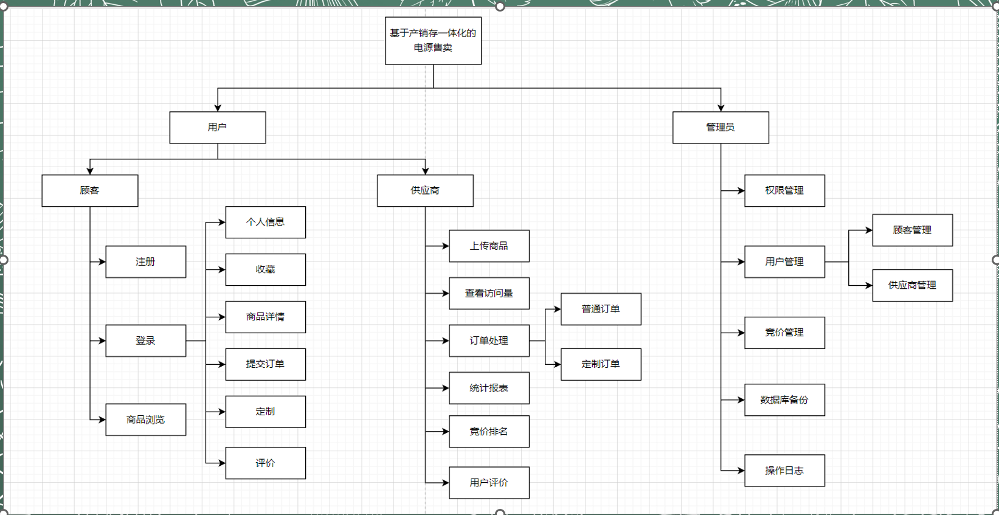

# 2023项目实训项目——电源产销存一体化系统

本项目使用**java17**版本和**MySQL8**版本  
请以**maven**的方式打开此项目

## 建立数据库

```sql
drop database if exists power_sell_sys;
create database power_sell_sys;
use power_sell_sys;
# 将power_sell_sys.sql的内容复制并运行
```

## 配置数据库相关配置

直接运行Main，第一次运行会进行mysql密码的配置（自动）。

## 项目介绍

分为三个角色：用户、供应商和管理员。


## 项目特色

1. 使用java17中的语法：如record类、增强switch语句。
2. 使用纯的java swing开发、简洁的页面
3. 结合mybatis和其分页插件page helper
